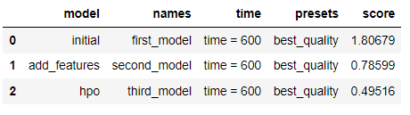
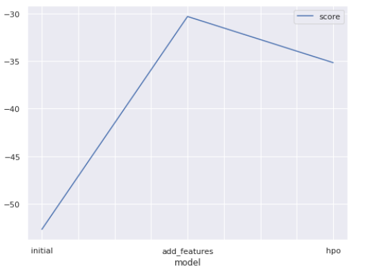
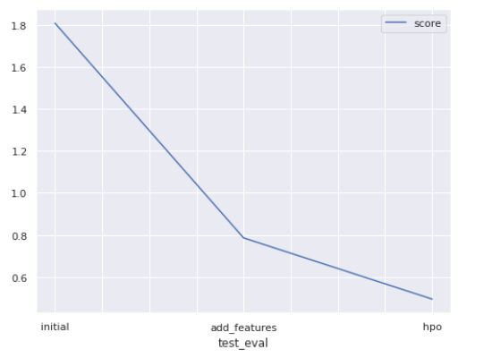

# Report: Predict Bike Sharing Demand with AutoGluon Solution
#### Mostafa Sayed Ali

## Initial Training
### What did you realize when you tried to submit your predictions? What changes were needed to the output of the predictor to submit your results?
at the first submition, I realize lack of features and some features need to be Categorical features rather than int,
so i work on that by adding some features such 'hour', 'day', 'month', 'year', 'times of the day', 'temp of the day', 'windspeed of the day'  to enhance model accuracy.
Handelled Negative Predictions by assign it by 0 if Founded.

### What was the top ranked model that performed?
the best ranked model is third model "WeightedEnsemble_L3" after adding features and hyperprameter tuning with score  0.51909 .
## Exploratory data analysis and feature creation
### What did the exploratory analysis find and how did you add additional features?
exploratory analysis was so usefull for me, after i  explored features i found that i can take features like 'hour', 'day', 'month', 'year'from datetime feature and alse i can add categorical features like 'times of the day', 'temp of the day', 'windspeed of the day' from hour , temp, windspeed features

### How much better did your model preform after adding additional features and why do you think that is?
my model preform better after adding some additional features and git higher score 0.84208

## Hyper parameter tuning
### How much better did your model preform after trying different hyper parameters?
my model preform much better after adding some additional features with adding  hyperparameters tunning and git higher score

### If you were given more time with this dataset, where do you think you would spend more time?
adding features and explore hyper prameter of models in autoglun to tune it

### Create a table with the models you ran, the hyperparameters modified, and the kaggle score.

### Create a line plot showing the top model score for the three (or more) training runs during the project.

TODO: Replace the image below with your own.

### Create a line plot showing the top kaggle score for the three (or more) prediction submissions during the project.

TODO: Replace the image below with your own.

## Summary
the score of algorithms increases after adding more features and tune hyperprameters
